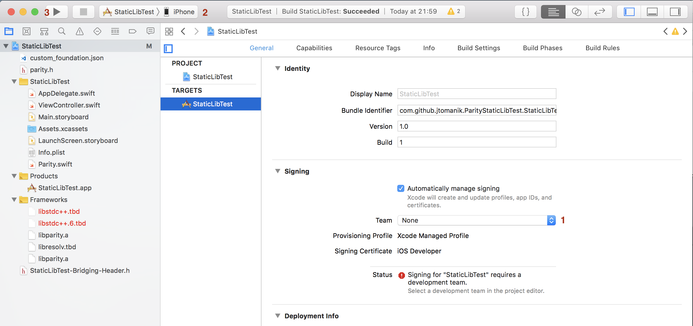

# Experimental Parity Light Client for iOS 

This is repo contains experimental work that aims at creating a build of Parity Library that works on iOS devices. This project is still at an early stage. 
This is a "living document" and I will be updating it as my work will be progressing.

## iOS library

This guide assumes that you already have an Xcode 10.1 installed and configured for development. 
Moreover, you need an iPhone device with the latest iOS (12.1) and a lightning cable in order to run builds on the device.  

## Get sources

### Example test project

Please check out [ParityStaticLibTest](https://github.com/jtomanik/ParityStaticLibTest) repository. 
This is a very basic project and you do not need any additional third-party tools to use it. 

After checking out that repo you won't be able to run that project due to linker error:

```
ld: library not found for -lparity
``` 

You will need to build a Parity library and place `libparity.a` in a `/lib` folder.

### Experimental Parity library

In order to build an experimental build of parity library for iOS, you need to check `feature/iOSlib` from this repo.
Next you will have to patch all the necessary dependencies and finally, you will be able to build the library. 

Note: every time when I use `~/.cargo/registry/src/github.com/` in a path I refer to a folder that contains sources checked out by `cargo`. 
Please adjust it accordingly to match a path where cargo stores sources on your machine.   


### Patching heapsize

Open file `~/.cargo/registry/src/github.com/heapsize-0.4.2/src/lib.rs`

There at a line 44 you should be able to find:

```
#[cfg_attr(any(prefixed_jemalloc, target_os = "macos", target_os = "ios", target_os = "android"), link_name = "je_malloc_usable_size")]
```

This line forces `malloc_usable_size` to be linked externally as `je_malloc_usable_size`. This works only if we're compiling an executable as Rust comes with jemalloc.
However, if we compile into the static lib Rust links against the system allocator and above will not work on systems that do not have jemalloc.
Unfortunately, iOS is one of such systems.

In order to patch heapsize and use on Mac's or iOS's malloc we need to change line 44 to:

```
#[cfg_attr(any(target_os = "macos", target_os = "ios"), link_name = "malloc_size")]
```  

### Patching Rust-Crypto
Open file `~/.cargo/registry/src/github.com/rust-crypto-0.2.36/src/util_helpers.c`  

There at the line 104 insert following snippet:

```
#ifdef __aarch64__
uint32_t rust_crypto_util_fixed_time_eq_asm(uint8_t* lhsp, uint8_t* rhsp, size_t count) {
    if (count == 0) {
        return 1;
    }
    uint8_t result = 0;
    asm(
        " \
            1: \
            \
            ldrb w4, [%1]; \
            ldrb w5, [%2]; \
            eor w4, w4, w5; \
            orr %w0, %w0, w4; \
            \
            add %w1, %w1, #1; \
            add %w2, %w2, #1; \
            subs %w3, %w3, #1; \
            bne 1b; \
        "
        : "+&r" (result), "+&r" (lhsp), "+&r" (rhsp), "+&r" (count) // all input and output
        : // input
        : "w4", "w5", "cc" // clobbers
   );

    return result;
}
#endif
```

This snippet adds support for ARM8 architecture and comes from [this PR](https://github.com/DaGenix/rust-crypto/pull/384)

### Patching parity-rocksdb-sys
Open file: `~/.cargo/registry/src/github.com/parity-rocksdb-sys-0.5.3/build.rs`

Go to line 25 and insert following snippet:

```
    if target_os.contains("ios") {
        cfg.cxxflag("-fno-rtti");
        cfg.cxxflag("-DIOS_CROSS_COMPILE");
    }
```

This adds necessary flags in order to cross-compile this lib.

Please note that this is not an ideal solution, nor even preferable one just first that worked. RocksDB should be compiled in "LITE" mode on iOS
as described [in INSTALL.md](https://github.com/facebook/rocksdb/blob/master/INSTALL.md) however, this currently would not work
as `C` interface is not included with the LITE build. See "future work" section for more details.

### Patching kvdb-rocksdb
Open file: `~/.cargo/registry/src/github.com/kvdb-rocksdb-0.1.4/src/lib.rs`

Go to the line 226 where `fn col_config(config: &DatabaseConfig, block_opts: &BlockBasedOptions) -> io::Result<Options>`
function starts and replace it with the following: 
```
fn col_config(config: &DatabaseConfig, block_opts: &BlockBasedOptions) -> io::Result<Options> {
    let mut opts = Options::new();
    #[cfg(target_os = "ios")] {
        Ok(opts)
    }

    #[cfg(not(target_os = "ios"))] {
        opts.set_parsed_options("level_compaction_dynamic_level_bytes=true").map_err(other_io_err)?;

        opts.set_block_based_table_factory(block_opts);

        opts.set_parsed_options(
            &format!("block_based_table_factory={{{};{}}}",
                     "cache_index_and_filter_blocks=true",
                     "pin_l0_filter_and_index_blocks_in_cache=true")).map_err(other_io_err)?;

        opts.optimize_level_style_compaction(config.memory_budget_per_col() as i32);
        opts.set_target_file_size_base(config.compaction.initial_file_size);

        opts.set_parsed_options("compression_per_level=").map_err(other_io_err)?;

        Ok(opts)
    }
}
```

Then go to line 284 where you should have `impl Database` and replace the following fragment:
```
impl Database {
    const CORRUPTION_FILE_NAME: &'static str = "CORRUPTED";

    /// Open database with default settings.
    pub fn open_default(path: &str) -> io::Result<Database> {
        Database::open(&DatabaseConfig::default(), path)
    }

    /// Open database file. Creates if it does not exist.
    pub fn open(config: &DatabaseConfig, path: &str) -> io::Result<Database> {
        let mut opts = Options::new();

        if let Some(rate_limit) = config.compaction.write_rate_limit {
            opts.set_parsed_options(&format!("rate_limiter_bytes_per_sec={}", rate_limit)).map_err(other_io_err)?;
        }
        opts.set_use_fsync(false);
        opts.create_if_missing(true);
        opts.set_max_open_files(config.max_open_files);
        opts.set_parsed_options("keep_log_file_num=1").map_err(other_io_err)?;
        opts.set_parsed_options("bytes_per_sync=1048576").map_err(other_io_err)?;
        opts.set_db_write_buffer_size(config.memory_budget_per_col() / 2);
        opts.increase_parallelism(cmp::max(1, ::num_cpus::get() as i32 / 2));

        let mut block_opts = BlockBasedOptions::new();

        {
            block_opts.set_block_size(config.compaction.block_size);
            let cache_size = cmp::max(8, config.memory_budget() / 3);
            let cache = Cache::new(cache_size);
            block_opts.set_cache(cache);
        }

        // attempt database repair if it has been previously marked as corrupted
        let db_corrupted = Path::new(path).join(Database::CORRUPTION_FILE_NAME);
        if db_corrupted.exists() {
            warn!("DB has been previously marked as corrupted, attempting repair");
            DB::repair(&opts, path).map_err(other_io_err)?;
            fs::remove_file(db_corrupted)?;
        }
```

with:

```
impl Database {
    const CORRUPTION_FILE_NAME: &'static str = "CORRUPTED";

    /// Open database with default settings.
    pub fn open_default(path: &str) -> io::Result<Database> {
        Database::open(&DatabaseConfig::default(), path)
    }

    /// Open database file. Creates if it does not exist.
    pub fn open(config: &DatabaseConfig, path: &str) -> io::Result<Database> {
        let mut opts = Options::new();

        #[cfg(not(target_os = "ios"))] {
        if let Some(rate_limit) = config.compaction.write_rate_limit {
                opts.set_parsed_options(&format!("rate_limiter_bytes_per_sec={}", rate_limit)).map_err(other_io_err)?;
        }
        opts.set_use_fsync(false);
        opts.set_max_open_files(config.max_open_files);
        opts.set_parsed_options("keep_log_file_num=1").map_err(other_io_err)?;
        opts.set_parsed_options("bytes_per_sync=1048576").map_err(other_io_err)?;
        opts.set_db_write_buffer_size(config.memory_budget_per_col() / 2);
        opts.increase_parallelism(cmp::max(1, ::num_cpus::get() as i32 / 2));
        }

        opts.create_if_missing(true);

        let mut block_opts = BlockBasedOptions::new();
        #[cfg(not(target_os = "ios"))]
        {
            block_opts.set_block_size(config.compaction.block_size);
            let cache_size = cmp::max(8, config.memory_budget() / 3);
            let cache = Cache::new(cache_size);
            block_opts.set_cache(cache);
        }

        // attempt database repair if it has been previously marked as corrupted
        let db_corrupted = Path::new(path).join(Database::CORRUPTION_FILE_NAME);
        if db_corrupted.exists() {
            warn!("DB has been previously marked as corrupted, attempting repair");
            #[cfg(not(target_os = "ios"))]
            DB::repair(&opts, path).map_err(other_io_err)?;
            fs::remove_file(db_corrupted)?;
        }
```

Lastly go to the line 372 and replace following snippet:
```
Err(ref s) if is_corrupted(s) => {
    warn!("DB corrupted: {}, attempting repair", s);
    DB::repair(&opts, path).map_err(other_io_err)?;
``` 

with:
```
Err(ref s) if is_corrupted(s) => {
    warn!("DB corrupted: {}, attempting repair", s);
    #[cfg(not(target_os = "ios"))]
    DB::repair(&opts, path).map_err(other_io_err)?;
``` 

Because RocksDB is built in a "full" mode it contains features that do not work iOS (or in any LITE build)
So I have disabled all custom configuration and explicitly unsupported functions in order to make a build that works,
Please see "Future work" sections for more information.

## Building iOS library

### Xcode Environment

Before you continue make sure you have Xcode build tools. If you already have the build tools installed and they are up to date, you can skip this step.
Otherwise, execute the following command in the terminal
```
xcode-select --install
```

### Rust environment (for non-Rust developers)
We will be using `rustup`. If you already have rustup installed, you can skip this step. 
Rustup installs Rust from the official release channels and enables you to easily switch between different release versions.

```
curl https://sh.rustup.rs -sSf | sh
```

Add the iOS architectures to `rustup` so we can use them during cross-compilation.
```
rustup target add aarch64-apple-ios armv7-apple-ios armv7s-apple-ios x86_64-apple-ios i386-apple-ios
```

When you installed Rust, it also installed `cargo`, which is a package. Now we will use cargo to install cargo-lipo. 
This is a cargo subcommand which automatically creates a universal library for use with iOS. 
Without this crate, cross-compiling Rust to work on iOS is infinitely harder.
```
cargo install cargo-lipo
```

Note: This guide was tested with `rustc 1.30.0 (da5f414c2 2018-10-24)`

### Building the library 

From the root folder of this repo ( one that contains this readme ) go to the `\parity-clib` subfolder and execute the following command:

```
cargo lipo --features malloc --release
```

Now go for a walk or just make yourself a coffee and fetch your favorite book. This process can take around an hour on a decent MacBook Pro.

### Copying the library
If everything went well you should be able to find `libparity.a` in the following directory (relative to the root folder of the repo):

`target\universal/release`

Please copy that file into the `\lib` directory in the folder where you have checked out ParityStaticLibTest repo.

### Running the ParityStaticLibTest 

Once you have `libparity.a` copied. Make sure you have your iPhone connected with the cable an open `StaticLibTest.xcodeproj` with Xcode.
You should be able to see the following screen: 



Now you need:
1. Change Team from `None` to your Personal Team
2. From the drop-down menu choose your iPhone
3. Press `Run` to start the build

(If you are not familiar with Xcode I've annotated the screenshot for you) 

Note: Before the first run you will get an error:
```
Could not launch “StaticLibTest”
```
Follow the instructions in the error message and run the project again.


Once you will have the app running you will be able to see log from running parity in the Debug Area (console log):
```
Docs directory /var/mobile/Containers/Data/Application/1ED484EE-5A0B-493A-898C-0D805BC61073/Documents
Chain spec directory /var/containers/Bundle/Application/7B84EECE-6539-4555-AAD6-56226B9AA441/StaticLibTest.app/custom_foundation.json
2018-11-28 22:15:16  Starting Parity-Ethereum/v2.2.0-unstable-49d1fd107-20181029/aarch64-ios/rustc1.30.0
2018-11-28 22:15:16  Keys path /var/mobile/Containers/Data/Application/1ED484EE-5A0B-493A-898C-0D805BC61073/Documents/keys/ethereum
2018-11-28 22:15:16  DB path /var/mobile/Containers/Data/Application/1ED484EE-5A0B-493A-898C-0D805BC61073/Documents/chains_light/ethereum/db/906a34e69aec8c0d
2018-11-28 22:15:16  Running in experimental Light Client mode.
2018-11-28 22:15:17  Inserting hardcoded block #6602753 in chain
2018-11-28 22:15:17  Debug API is not available in light client mode.
Starting ``RPC test...
{"jsonrpc":"2.0","result":"0x0","id":1}
2018-11-28 22:15:17  Public node URL: enode://69ac902f8b195b87656c3b3f627990d572c5647ce4f4a19fe221f0e1c9241a0016e12278efef3d70ddb1b1f4a73ff377dcb6f121bf6e36bb72cabc21f413b508@10.125.239.37:30303
2018-11-28 22:15:47     1/50 peers   568 bytes cache  0 bytes queue  RPC:  0 conn,    0 req/s, 1715 µs
2018-11-28 22:16:07  Syncing #6602753 0x9f02…1e30     0.0 hdr/s   5630+    0 Qed   2/50 peers   568 bytes cache    4 MiB queue  RPC:  0 conn,    0 req/s, 1715 µs
size check8388608block_bytes check8388608
2018-11-28 22:16:12  Syncing #6603820 0x74fe…12a6   213.3 hdr/s  25811+    0 Qed   3/50 peers    589 KiB cache   19 MiB queue  RPC:  0 conn,    0 req/s, 1715 µs
2018-11-28 22:16:17  Syncing #6604910 0x1826…8cce   217.8 hdr/s  30097+    0 Qed   3/50 peers      1 MiB cache   22 MiB queue  RPC:  0 conn,    0 req/s, 1715 µs
2018-11-28 22:16:22  Syncing #6606436 0xf60f…de0d   305.0 hdr/s  28699+    0 Qed   3/50 peers      2 MiB cache   21 MiB queue  RPC:  0 conn,    0 req/s, 1715 µs
2018-11-28 22:16:27  Syncing #6607976 0xbbb1…ccfe   307.9 hdr/s  28567+    0 Qed   4/50 peers      3 MiB cache   21 MiB queue  RPC:  0 conn,    0 req/s, 1715 µs
2018-11-28 22:16:32  Syncing #6609495 0x234a…ddb1   303.5 hdr/s  28584+    0 Qed   2/50 peers      4 MiB cache   21 MiB queue  RPC:  0 conn,    0 req/s, 1715 µs
2018-11-28 22:16:37  Syncing #6611024 0x5b3c…4c40   305.5 hdr/s  28591+    0 Qed   3/50 peers      4 MiB cache   21 MiB queue  RPC:  0 conn,    0 req/s, 1715 µs
2018-11-28 22:16:42  Syncing #6612508 0x5f32…70dd   296.5 hdr/s  28643+    0 Qed   3/50 peers      5 MiB cache   21 MiB queue  RPC:  0 conn,    0 req/s, 1715 µs
size check8388608block_bytes check8388608
2018-11-28 22:16:47  Syncing #6614056 0x9a91…e5ac   309.5 hdr/s  28503+    0 Qed   6/50 peers      6 MiB cache   21 MiB queue  RPC:  0 conn,    0 req/s, 1715 µs
2018-11-28 22:16:52  Syncing #6615584 0x6c89…c653   305.5 hdr/s  29535+    0 Qed   7/50 peers      7 MiB cache   22 MiB queue  RPC:  0 conn,    0 req/s, 1715 µs
2018-11-28 22:16:57  Syncing #6617122 0x2697…03a3   307.4 hdr/s  28509+    0 Qed   7/50 peers      8 MiB cache   21 MiB queue  RPC:  0 conn,    0 req/s, 1715 µs
2018-11-28 22:17:02  Syncing #6618645 0xc022…739d   304.4 hdr/s  28522+    0 Qed   4/50 peers      9 MiB cache   21 MiB queue  RPC:  0 conn,    0 req/s, 1715 µs
2018-11-28 22:17:07  Syncing #6620194 0xda64…70bc   309.5 hdr/s  29789+    0 Qed   5/50 peers      9 MiB cache   22 MiB queue  RPC:  0 conn,    0 req/s, 1715 µs
2018-11-28 22:17:12  Syncing #6621702 0xee06…acdd   301.4 hdr/s  29177+    0 Qed   6/50 peers     10 MiB cache   21 MiB queue  RPC:  0 conn,    0 req/s, 1715 µs
size check8388608block_bytes check8388608
2018-11-28 22:17:17  Syncing #6623224 0x2a54…c1bf   304.3 hdr/s  29703+    0 Qed   6/50 peers     10 MiB cache   22 MiB queue  RPC:  0 conn,    0 req/s, 1715 µs
2018-11-28 22:17:22  Syncing #6624743 0x9b3b…e752   303.7 hdr/s  28568+    0 Qed   4/50 peers     10 MiB cache   21 MiB queue  RPC:  0 conn,    0 req/s, 1715 µs
2018-11-28 22:17:27  Syncing #6626281 0x9226…143e   307.6 hdr/s  28566+    1 Qed   7/50 peers     10 MiB cache   21 MiB queue  RPC:  0 conn,    0 req/s, 1715 µs
2018-11-28 22:17:32  Syncing #6627790 0xa867…3984   301.5 hdr/s  28593+    0 Qed   5/50 peers     10 MiB cache   21 MiB queue  RPC:  0 conn,    0 req/s, 1715 µs

```
(Results from iPhone 6S Plus)

Note: If you can't see Debug Area click `View->Debug Area-> Show Debug Area`

# Future work

This section contains currently planned steps on a road to the viable iOS framework:

## Potential improvements

### Performance benchmarking
Before starting further work on improving the performance I need to create a way to automatically log results and do test runs
on different devices. That will allow me to establish a baseline performance profile and properly measure future performance gains. 

### RocksDB tuning
Currently, RocksDB runs on default settings, I'll have to research what settings are supported on mobile devices and what changes may bring performance improvements.

### Jemalloc
In my tests so far builds with Jemalloc got at least 2x performance boost. I'll have to revisit that work and figure out how to enable Jemalloc while building RocksDB 

### RocksDB Lite
RockDB has a special "LITE" compile option that creates a build optimised for use on mobile devices. Unfortunately, currently, that build does not contain a C interface that Rust wrapper depends on.
I'm working on curating normal C interface in order to create a subset that would support features available in a LITE build. Once that done I'll need to update Rust wrapper to use that when compiling for iOS.

### Custom chainspec 
One of the available ways to speed up initial synchronization is to provide a custom chainspec that would contain a hardcoded header that is ~24h old. That will greatly reduce the amount of data needed to process during the initial sync.

# Good to know stuff
For people not familiar with the Rust

## Nightly Rust environment

Available `rustup` options are: `stable`, `beta`, `nightly`

`rustup update nightly`

`rustup override set nightly`

`rustup target add aarch64-apple-ios armv7s-apple-ios armv7-apple-ios x86_64-apple-ios i386-apple-ios`

## Cleaning the environment

Local builds:

`cargo clean`

Downloaded crates:

`rm -rf ~/.cargo/registry/src`

Note: When you discard downloaded crates, you will have to apply patches again.